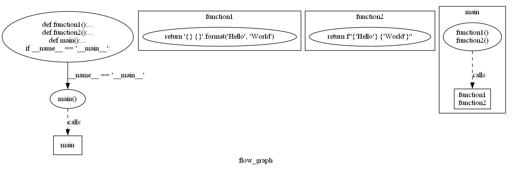

# CPython Internals

1. Source Code
2. Compiler
3. AST (Abstract Syntax Tree)
4. Control Flow Graph
5. Bytecode
6. Interpreter

## Bytecode
1. line#
2. Offset
3. Operation Name
4. Arg Index
5. Arg Value

## Syntax Tree Beispiel:
```
Module(
   body=[
      FunctionDef(
         name='function1',
         args=arguments(
            posonlyargs=[],
            args=[],
            kwonlyargs=[],
            kw_defaults=[],
            defaults=[]),
         body=[
            Return(
               value=Call(
                  func=Attribute(
                     value=Constant(value='{} {}'),
                     attr='format',
                     ctx=Load()),
                  args=[
                     Constant(value='Hello'),
                     Constant(value='World')],
                  keywords=[]))],
         decorator_list=[]),
      FunctionDef(
         name='function2',
         args=arguments(
            posonlyargs=[],
            args=[],
            kwonlyargs=[],
            kw_defaults=[],
            defaults=[]),
         body=[
            Return(
               value=JoinedStr(
                  values=[
                     FormattedValue(
                        value=Constant(value='Hello'),
                        conversion=-1),
                     Constant(value=' '),
                     FormattedValue(
                        value=Constant(value='World'),
                        conversion=-1)]))],
         decorator_list=[]),
      FunctionDef(
         name='main',
         args=arguments(
            posonlyargs=[],
            args=[],
            kwonlyargs=[],
            kw_defaults=[],
            defaults=[]),
         body=[
            Expr(
               value=Call(
                  func=Name(id='function1', ctx=Load()),
                  args=[],
                  keywords=[])),
            Expr(
               value=Call(
                  func=Name(id='function2', ctx=Load()),
                  args=[],
                  keywords=[]))],
         decorator_list=[]),
      If(
         test=Compare(
            left=Name(id='__name__', ctx=Load()),
            ops=[
               Eq()],
            comparators=[
               Constant(value='__main__')]),
         body=[
            Expr(
               value=Call(
                  func=Name(id='main', ctx=Load()),
                  args=[],
                  keywords=[]))],
         orelse=[])],
   type_ignores=[])
```
## Control Flow Graph


## Bytecode
```
  5           0 LOAD_CONST               1 ('{} {}')
              2 LOAD_METHOD              0 (format) 
              4 LOAD_CONST               2 ('Hello')
              6 LOAD_CONST               3 ('World')
              8 CALL_METHOD              2
             10 RETURN_VALUE
  9           0 LOAD_CONST               1 ('Hello')
              2 FORMAT_VALUE             0
              4 LOAD_CONST               2 (' ')    
              6 LOAD_CONST               3 ('World')
              8 FORMAT_VALUE             0
             10 BUILD_STRING             3
             12 RETURN_VALUE
```
